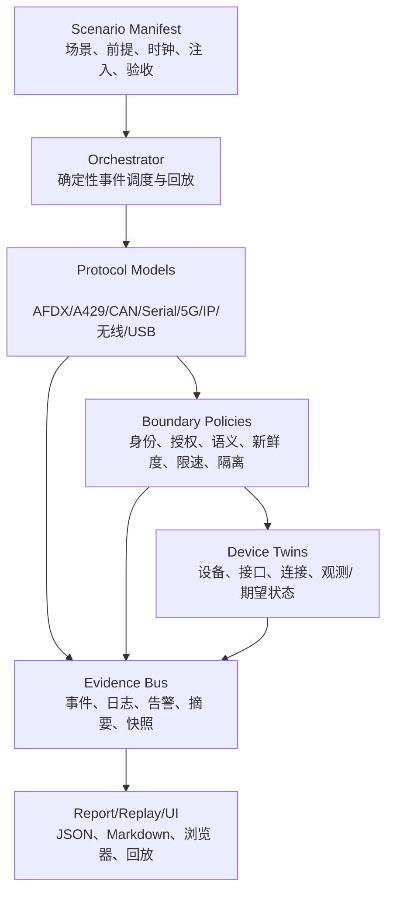

# 航空协议安全锦标赛：完善版仿真方案

## 1. 目标和边界

本方案把现有 ARINC 429、RS-232/RS-422、5G-ATG、民航运动学、虚拟硬件、设备孪生和跨模型事件链，扩展为可覆盖全部比赛题型的分层、可复现、可审计数字仿真平台。

目标不是在浏览器中直接操纵真实航空系统，也不是证明某一具体飞机已经被攻破。目标是：

1. 用统一仿真时钟驱动协议状态、设备状态、故障注入和跨域事件；
2. 使每个题目有独立协议模型、攻击/故障前提、边界策略、检测点和证据；
3. 使不同协议可以通过语义消息和受控网关连接，而不是直接传递任意原始报文；
4. 对正常、异常、拒绝、降级、恢复和回放都有可复现结果；
5. 让每条结论追溯到模型版本、输入场景、事件序列、证据摘要和测试验收；
6. 保持 `simulation_only=true`，不打开真实串口、无线、网络、飞机接口或公共频谱。

## 2. 现状和关键缺口

### 2.1 当前已具备

| 能力 | 当前实现 | 结论 |
|---|---|---|
| ARINC 429 字、奇偶、速率、网关 | `sim/arinc429_lab.py` | 可做协议与受控入口验证 |
| RS-232/RS-422 帧、CRC、双工、维护边界 | `sim/serial_lab.py` | 可做串行接口验证 |
| 5G-ATG UE/gNB/核心网/N3/N6/OAM | `sim/atg5g_lab.py` | 可做数字安全状态验证 |
| 飞行状态与 ARINC 传感器发布 | `sim/civil_aviation_platform.py` | 可做运动学/可选 JSBSim 适配 |
| 虚拟 ARINC 卡、LRU、PX4 HIL 端点 | `sim/virtual_hardware*.py` | 可做软件闭环，不等同实体 HIL |
| 设备、接口、拓扑、状态和事件 | `sim/twin/` | 可做浏览器孪生和状态过期 |
| 统一链路时钟与证据摘要 | `sim/twin/chain.py` | 已有语义链，但仍需消息级贯通 |
| 一键编排 | `scripts/run_all_simulations.py` | 可运行当前模型集合 |

### 2.2 必须补齐

1. **消息级贯通：** 当前跨模型链主要通过阶段结果映射，下一阶段必须使用统一 `MessageEnvelope` 在 N6、跨域网关、串行桥、A429 和 LRU 之间逐跳传递；每跳保留输入摘要、策略决策和输出摘要。
2. **协议模型扩展：** AFDX、ARINC 825/CAN、Ethernet/FTP/UDP/SNMP/ARINC 615A、USB、ADS-B、ACARS、GPS、Wi-Fi 目前主要是题目登记，尚未形成可执行模型。
3. **故障与攻击前提：** 每个场景必须区分物理接入、合法维护权限、受损设备、配置错误、链路干扰和逻辑伪造，不能把任意入口默认成立。
4. **时间和因果：** 每个事件必须同时有仿真时间、单调序号、父事件、协议层、设备/接口、处理延迟和证据引用。
5. **观察与控制分离：** 仿真状态、期望状态、策略决策、检测告警和最终输出不能合并为一个 `online` 字段。
6. **恢复验证：** 现有场景重点是接受/拒绝，必须增加超时、重连、冗余切换、配置回滚、隔离、恢复和证据完整性验证。
7. **跨题目复用：** 所有题目使用相同的场景、证据、风险量化、报告和验收结构，新增协议不能复制一套新的运行器。

## 3. 分层架构



### 3.1 场景层

场景使用 JSON/YAML 等价结构描述，不在 Python 代码中硬编码攻击流程。每个场景至少包含：

```text
scenario_id
题目编号和版本
simulation_only
clock: epoch_ms, step_ms, duration_ms
aircraft_phase: ground/maintenance/taxi/cruise/approach
assets and domains
connections and trust boundaries
injections: type, target, preconditions, start, duration, parameters
expected_decisions
acceptance_checks
evidence_level
```

默认场景必须可在无外部依赖的纯 Python 环境运行。场景缺字段、引用未知设备/接口、注入不满足前提时必须失败并给出结构化错误，不能静默放宽条件。

### 3.2 统一仿真时钟

时钟采用离散事件模型：

- `sim_time_ms`：唯一业务时间，所有协议状态和设备观察使用它；
- `monotonic_sequence`：全局事件序号，防止同一时间事件顺序不确定；
- `wall_time`：仅记录运行环境时间，不参与安全判定；
- `parent_event_id`：建立跨协议因果关系；
- `processing_delay_ms`：记录每个模型和策略边界引入的延迟；
- `seed`：只用于允许随机性的场景，并写入证据；默认场景完全确定性。

同一时间的事件按优先级固定排序：物理/链路输入 → 协议解析 → 安全策略 → 设备状态 → 输出/告警 → 快照。回放使用事件序列，不重新猜测时间。

### 3.3 统一消息封装

新增协议适配器必须将原始模型输出包装成语义消息，不允许跨域直接传递任意原始报文：

```text
MessageEnvelope:
  message_id
  correlation_id
  parent_event_id
  sim_time_ms
  source_device
  source_interface
  target_device
  target_interface
  protocol
  message_class
  payload_digest
  semantic_fields
  authenticity: unknown/verified/rejected
  freshness: fresh/stale/replay/unknown
  authorization: allowed/denied/unknown
  safety_impact: none/diagnostic/operational
  simulation_only
```

原始字段只在所属协议模型内部保留；跨域网关输出必须是经过策略判定的语义字段和证据摘要。这样可以同时表达“格式合法但来源不可信”“认证成功但业务未授权”“数据新鲜但语义越界”等状态。

## 4. 协议模型设计

每个协议模块实现相同的适配器契约：

```text
ProtocolModel.describe() -> ProtocolProfile
ProtocolModel.accept(envelope, clock) -> AdmissionDecision
ProtocolModel.observe(clock) -> ObservedState
ProtocolModel.inject(fault, clock) -> InjectionResult
ProtocolModel.reset(mode) -> ResetResult
ProtocolModel.evidence() -> EvidenceRecord[]
```

`inject` 仅接受场景中声明的白名单故障/负向验证动作，不接受任意原始报文、任意目标地址或真实设备参数。

### 4.1 已有模型保持不变

- ARINC 429：保留奇偶、标签、速率、来源认证、新鲜度、语义和限速模型；增加 `MessageEnvelope` 适配。
- RS-232/RS-422：保留帧、CRC、全双工、维护命令和速率模型；增加串行桥输入/输出策略。
- 5G-ATG：保留注册、N3/N6、TEID/QFI、DNN、OAM、边界和数据完整性模型；将 N6 结果转为语义消息。
- 虚拟硬件/PX4：保留安全默认未解锁、传感器/GPS 超时和 HIL 反馈；只消费加固网关输出。

### 4.2 AFDX 模型

第一阶段只做离线确定性模型：

- VL ID、源/目的端系统、BAG、最大帧长度、序列号和双网冗余；
- 发送调度、队列占用、时延、丢帧、重复和乱序；
- VL 配置越界、BAG 配置错误、冗余不一致、端系统边界校验错误；
- 维护域/客舱域到核心域的路由策略；
- 验收：超出 BAG 的流被限速，双网去重稳定，配置漂移产生告警，策略拒绝不产生核心域输出。

### 4.3 ARINC 825/CAN 模型

- 标准/扩展帧、标识符仲裁、数据长度、错误计数和总线负载；
- 监听、重放、优先级占用、错误注入的抽象状态机；
- 节点身份、报文白名单、周期/变化率和电源/客舱业务语义；
- 验收：低优先级业务不能被无界洪泛吞掉，高优先级安全策略不绕过授权；错误被隔离而非无限重试。

### 4.4 Ethernet/FTP/UDP/SNMP/ARINC 615A 模型

分层模拟，不实现真实数据加载到设备：

- Ethernet：端口、VLAN/域、MAC 学习、广播/组播、链路故障和交换边界；
- FTP：会话、身份、目录授权、明文/安全封装标识和数据加载状态机；
- UDP：无连接消息、来源校验、序列/时间窗、重放和速率限制；
- SNMP：只读/配置角色、版本、管理面隔离、配置变更审批和审计；
- ARINC 615A：文件/块/校验/版本/回滚语义，以合成装载包为输入；
- 验收：未授权文件不能进入机载目标，版本不匹配可回滚，管理面不能从客舱域到达，UDP 陈旧消息被拒绝。

### 4.5 USB 模型

- 主机/设备枚举状态、设备类、序列号、固件版本、供电状态和维护模式；
- 维护 USB 与客舱 USB 使用不同策略；
- 合成设备类欺骗、固件签名失败、自动执行策略、数据导出和审计；
- 不实现 BadUSB 的真实 HID 注入，只模拟检测/拒绝/隔离结果；
- 验收：未知设备不获得维护权限，签名/版本失败进入隔离，客舱 USB 永不跨入核心航电域。

### 4.6 ADS-B/ACARS/GPS/Wi-Fi 模型

全部采用离线状态机和信号质量抽象，不发射 RF：

- ADS-B：消息身份、位置/速度合理性、时间新鲜度、多源交叉检查、异常目标标记；
- ACARS/卫星：链路模式、地址、报文完整性、来源/重放、业务路由和人工确认；
- GPS：捕获/跟踪/定位解算质量、时间跳变、惯导交叉检查、降级和恢复；
- Wi-Fi：客舱/维护 SSID、认证状态、管理面、隔离策略、Evil Twin 可见性抽象和切换保护；
- 验收：异常输入被标记为不可信并触发降级，不直接写入安全关键消费者。

## 5. 设备孪生和状态模型

设备状态继续分为身份、连接、配置、运行、安全、证据六层。每层必须保留：

```text
observed_value
expected_value
source
observed_at
valid_until / stale_after
confidence
sequence
evidence_ids
```

状态不允许使用单一 `online` 代替：

- 电源：`on/off/unknown`；
- 物理链路：`up/down/degraded/unknown`；
- 协议会话：`registered/established/expired/unknown`；
- 认证：`verified/failed/not_applicable/unknown`；
- 授权：`allowed/denied/pending/unknown`；
- 数据流：`flowing/blocked/stale/replayed/unknown`；
- 健康：`healthy/degraded/failsafe/unknown`；
- 证据：来源、年龄、可信度、等级和哈希。

任何采集超时、事件序列冲突、配置版本冲突或证据断裂都必须在孪生页面显示告警，不能继续显示新鲜正常状态。

## 6. 统一故障和负向验证目录

每个故障都有 ID、适用协议、前提、注入点、预期检测、预期安全决策和恢复动作：

| 故障族 | 示例 | 预期结果 |
|---|---|---|
| 认证 | 未知来源、签名/MAC失败、证书状态异常 | 拒绝、告警、无下游输出 |
| 新鲜度 | 重放、时间窗过期、序列回退 | 标记 stale/replay，拒绝业务处理 |
| 语义 | 范围越界、变化率过快、单位/版本不匹配 | 语义拒绝或安全降级 |
| 可用性 | 洪泛、队列满、BAG超限、总线错误 | 限速、隔离、保留关键业务预算 |
| 配置 | 速率/BAG/VL/VLAN/SSID/策略漂移 | 漂移告警、禁止自动放行 |
| 设备 | 心跳丢失、传感器超时、固件不可信 | failsafe、冗余切换或人工确认 |
| 边界 | 客舱到航电、维护到核心、N6到LRU | 默认拒绝、审计、无物理输出 |
| 恢复 | 重连、回滚、主备切换、时钟恢复 | 状态可追溯、无旧事件覆盖新状态 |

## 7. 证据链和回放

每次场景生成一个 `RunManifest`：

```text
run_id
scenario_id
commit_sha
model_versions
python/platform
simulation_clock
seed
inputs_digest
ordered_events
state_snapshots
policy_decisions
alerts
outputs_digest
limitations
```

证据分为：

- `L1 local_reproduction`：本地测试直接复核；
- `L2 existing_report`：既有报告和已存结果；
- `L3 engineering_analysis`：有依据的工程推演；
- `L4 authorized_bench_pending`：必须到授权台架/真实设备补证。

回放必须做到：相同 commit、场景版本、输入摘要和 seed 产生相同事件序列和输出摘要；输入或模型哈希改变时，运行结果标记为不可直接比较。

## 8. 题目覆盖和实施顺序

### 阶段 A：平台可靠性

1. 将 `MessageEnvelope` 接入现有 5G→N6→串行→A429→LRU/PX4 链；
2. 把 `chain.py` 中硬编码阶段状态替换为逐跳适配器决策；
3. 为运行清单增加 commit、场景版本、输入摘要、证据等级和回放校验；
4. 增加超时、回滚、配置漂移、证据断裂和恢复测试。

**阶段验收：** 正常链逐跳传递；注入/重放/篡改在正确边界拒绝；同一输入两次回放字节级稳定；下游没有 `physical_output`。

### 阶段 B：高分协议模型

按类型一优先实现：

1. AFDX；
2. ARINC 825/CAN；
3. Ethernet/FTP/UDP/SNMP/ARINC 615A；
4. USB；
5. ADS-B、ACARS、GPS、Wi-Fi。

每个模型先完成正常路径和安全负向路径，再接入孪生和报告，不先实现无边界攻击动作。

**阶段验收：** 每个协议至少有一份 profile、一个适配器、一个正常场景、三个负向场景、一个回放证据、一个报告章节和一组行为测试。

### 阶段 C：跨题目攻击链和防御

1. 物理接口链：USB/串行/以太网维护域 → 受控网关 → 核心域；
2. 无线空口链：Wi-Fi/ADS-B/ACARS/5G 状态异常 → 空地/客舱边界 → 运营或航电消费者；
3. 地面网络链：保障网/OAM/串口服务器 → N6/维护策略 → 串行/A429/AFDX；
4. 每条链输出攻击参数、检测点、最小阻断点、敏感性分析和纵深防御对照。

**阶段验收：** 每条链的每个节点都能回溯到类型一漏洞编号和事件证据；链路在任一阻断点停止，不能跳过策略直接进入目标消费者。

### 阶段 D：报告和比赛交付

1. 每个题目从 `report/REPORT_TEMPLATE.md` 建立报告；
2. 报告与脚本、测试、JSON、日志和模型版本互相链接；
3. 一键编排器增加题目 profile 选择和证据包索引；
4. CI 对所有已实现题目运行正常/负向/回放验收；
5. 维护责任人、审查人、证据等级和待补台架证据矩阵。

## 9. 统一验收门槛

### 功能门槛

- 正常链路端到端完成；
- 未授权、重放、篡改、语义越界、洪泛和配置漂移按预期拒绝/降级；
- 状态过期、失联、冲突和恢复可观察；
- 所有事件有统一时间、序号、来源和父事件；
- 所有结果可 JSON 导出和离线回放。

### 证据门槛

- 每个结论至少绑定一个脚本/测试/JSON/日志或明确的工程分析依据；
- 每个真实系统结论标明需要的 ICD、配置、设备日志或授权台架；
- 报告不使用无来源标准、CVE、量化数据或适航断言；
- 证据摘要与模型/场景/提交号一致。

### 安全门槛

- 仿真默认只绑定本地或不打开外部接口；
- 没有任意原始报文发送、公共频谱动作、真实设备控制或横向移动实现；
- 所有负向验证以白名单场景动作表达；
- 安全默认是拒绝、隔离、降级或人工确认，而不是继续输出。

### 工程门槛

```bash
python3 -m pytest -q
python3 scripts/run_all_simulations.py --profile quick
python3 scripts/run_cross_model_chain.py --scenario normal
python3 scripts/run_cross_model_chain.py --scenario injection
git diff --check
```

CI 必须在 Python 3.11 和 3.12 上通过；完整 `full` profile 作为赛前人工复核，不阻塞每次 PR 的快速反馈。

## 10. 当前下一步

1. 先把 `MessageEnvelope` 和逐跳策略决策接入现有跨模型链；
2. 增加 `RunManifest` 和确定性回放校验；
3. 实现 AFDX 与 ARINC 825 两个缺口模型，优先覆盖题目要求中的调度、仲裁、冗余、错误和边界；
4. 实现 Ethernet/FTP/UDP/SNMP/ARINC 615A 的维护数据加载模型；
5. 再实现 USB、ADS-B、ACARS、GPS、Wi-Fi 状态机；
6. 每完成一个题目，立即补齐报告、证据和题目矩阵，不积累未验证的空报告。

该方案保持当前项目的核心边界：模型结果是数字仿真和工程分析证据，不是具体机型的适航结论，也不是真实航空系统已经遭受攻击的证明。
