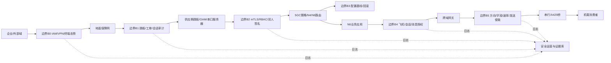

# 类型三-2：跨域攻击链全链路纵深防御方案

**比赛：** 航空协议安全锦标赛初赛  
**题目类型：** 类型三第 2 题（选答）  
**版本：** 1.0  
**日期：** 2026-09-11  
**关联链路：** 类型二第 3 题“地面网络接入型跨域攻击链”  
**证据等级：** L1 本地复核 + L2 既有报告记载 + L3 工程分析；真实系统项为 L4 待实装验证

## 1. 摘要

本报告针对地面保障网络、供应商维护跳板、5GC OAM/OSS、N6 业务应用、串行/A429 跨协议网关和机载数据消费者组成的条件性跨域链路，设计检测、防护、响应和恢复四类纵深防御措施。

核心结论是：初始进入地面网络不是进入航空器；最小阻断点集中在三个位置：G3/G4 管理配置发布、G5/G6 业务跨域网关、G6/G7 受控协议输出。三处均必须独立执行默认拒绝、身份/会话绑定、语义授权、审计和恢复控制。任一处有效，链路不能无条件闭合。

本报告基于现有合成模型和既有报告，不提供针对真实航空器、生产网络、公共频谱或真实设备的攻击操作指令。真实部署需以具体机型 ICD、设备版本、账号矩阵、网络拓扑、FHA/SSA、安全架构和授权隔离台架验证。

## 2. 链路范围和安全目标

### 2.1 继承链路

```text
G1 外部/企业网
 → G2 地面保障网络
 → G3 供应商跳板、OAM或串口服务器
 → G4 5GC路由/策略配置
 → G5 N6应用/运行监视/机务平台
 → G6 客舱/维护/航电跨域网关
 → G7 串行/A429桥接器
 → G8 机载数据消费者/放行数据
```

### 2.2 安全目标

1. 未授权身份不能获得维护配置或端口控制权；
2. 只读管理权限不能改变 OAM、N4/PFCP、DNN、S-NSSAI、N6 或边界路由；
3. N6 消息必须绑定飞机、航班、会话、来源域、序号、时间窗和业务类型；
4. 客舱/地面/维护数据不能直接转为航电写入；
5. 串行和 A429 输出必须只有受控发送路径；
6. 所有拒绝、配置变化、异常输出、状态降级和恢复都可审计；
7. 故障和攻击状态不会通过自动重试扩大影响；
8. 恢复前必须验证配置、身份、序列、时钟、证据和下游状态。

## 3. 架构与信任边界



| 边界 | 不能继承的信任 | 防御目标 |
|---|---|---|
| B0 | 企业网络可达不等于维护身份 | MFA、设备态势、来源位置和会话风险 |
| B1 | 内部账号不等于供应商/OAM权限 | 跳板白名单、工单、时间窗、录屏和命令范围 |
| B2 | 管理员身份不等于配置发布授权 | mTLS、最小 RBAC、双人审批、签名配置 |
| B3 | 配置成功下发不等于配置正确 | 基线、差异、仿真负向、回滚和生效确认 |
| B4 | 源 IP、TEID、QFI、VLAN 不等于业务来源 | 飞机/航班/会话/序号/时间/消息认证 |
| B5 | 网关可达不等于航电写权限 | 默认拒绝、单向/只读代理、发送使能、语义 allowlist |

## 4. 节点级纵深防御矩阵

### 4.1 G1：外部/企业网身份入口

| 类别 | 措施 |
|---|---|
| 防护 | MFA；设备证书；终端健康检查；按工单和时间窗授权；禁止共享账号；将供应商账号与团队账号隔离 |
| 检测 | 登录失败、异常地理/网络位置、非工单访问、设备态势变化、异常时间段 |
| 响应 | 吊销会话和令牌；隔离终端；冻结相关工单；保留 IAM 和 VPN 证据 |
| 恢复 | 重新核验人员、设备、工单和最小权限；不得直接恢复原会话；复核后生成新授权 |
| 验收 | 无工单或设备不合规时不能到达保障网；拒绝事件关联用户、设备、时间和理由 |

### 4.2 G2：地面保障网络

| 类别 | 措施 |
|---|---|
| 防护 | 维护网与办公网/互联网分区；跳板和管理面专用 VLAN；默认拒绝横向路由；限制到 OAM/串口服务器的端口集合 |
| 检测 | 新终端、异常东西向流量、扫描、管理端口访问、跨 VLAN 路由变化 |
| 响应 | 网络隔离源终端；阻断会话；通知 SOC 和维护负责人；保存流量元数据，不采集不必要的敏感业务载荷 |
| 恢复 | 检查 ACL、路由和终端基线；通过签名配置恢复；确认没有持久化未授权规则 |
| 验收 | 普通保障网身份无法访问 OAM/串口控制面；允许的维护流必须有工单和审计关联 |

### 4.3 G3：供应商跳板、OAM 和串口服务器

| 类别 | 措施 |
|---|---|
| 防护 | 管理面独立；设备证书/mTLS；角色最小权限；命令 allowlist；串口端口默认关闭；地面状态和物理使能互锁；双人审批敏感动作 |
| 检测 | 登录与角色不匹配、非窗口操作、命令不在工单、端口启用、会话录屏异常、维护状态不符 |
| 响应 | 终止会话；撤销临时权限；关闭端口；锁定敏感命令；冻结配置发布；产生不可篡改审计记录 |
| 恢复 | 重新加载已签名基线；检查串口桥/跳板持久化配置；重新认证设备和操作员；开展无副作用检查 |
| 验收 | 读权限不能执行写命令；空中/非维护状态不能启用写端口；未批准串口输出为零 |

### 4.4 G4：5GC 路由、DNN、切片和 N4/PFCP 策略

| 类别 | 措施 |
|---|---|
| 防护 | DNN、S-NSSAI、TEID、QFI、UE、N3 对端和目标应用完整绑定；配置签名；双人审批；变更窗口；策略控制器阻断客舱到航电路由；禁止 OAM 直接绕过策略 |
| 检测 | 配置 diff、未签名/未审批变更、DNN/S-NSSAI/TEID/QFI 错配、异常 PFCP/N4、规则跨域变化、回滚失败 |
| 响应 | 拒绝生效；撤销配置发布权限；隔离相关会话；恢复上一个签名版本；告警关联变更人、工单和影响范围 |
| 恢复 | 在离线仿真/验证环境比对；签名基线重新发布；核验 UPF 会话、N3 对端和 N6 ACL；清理旧会话和旧规则 |
| 验收 | 修改任一绑定字段都无应用副作用；未授权配置返回拒绝；回滚后路由和证据一致 |

### 4.5 G5：N6 业务应用、运行监视和机务平台

| 类别 | 措施 |
|---|---|
| 防护 | 应用级 mTLS 或经批准的消息认证；飞机/航班/会话绑定；消息类型 allowlist；序列/时间窗；schema、范围、变化率和幂等校验；维护写操作人工复核 |
| 检测 | 认证失败、重放、序列回退、过期、飞机/航班错配、payload 突变、异常速率、未知业务类型 |
| 响应 | 丢弃消息但保留证据；隔离来源/会话；不写入数据库或航电命令队列；触发告警和人工复核 |
| 恢复 | 清理陈旧队列；重建会话；核对飞机/航班状态和时间同步；从可信快照恢复业务状态；确认幂等后再放行 |
| 验收 | 篡改/重放/错配消息不改变业务状态；拒绝事件有输入摘要、策略、来源和时间 |

### 4.6 G6：客舱/维护/航电跨域网关

| 类别 | 措施 |
|---|---|
| 防护 | 默认拒绝；物理和逻辑分域；优先单向/只读代理；按飞机、会话、方向、消息类型、字段、速率和安全目标授权；禁止通用 IP 路由和任意原始报文透传 |
| 检测 | 客舱/地面到航电写入尝试、策略拒绝、目标变化、规则漂移、下游输出尝试、绕过路径 |
| 响应 | 丢弃并告警；吊销会话；将源放入隔离队列；锁定策略变更；保留输入/输出摘要和物理输出状态 |
| 恢复 | 复核边界策略和旁路；恢复签名策略；重新建立只读会话；检查下游没有副作用；通过人工确认恢复业务 |
| 验收 | 客舱命令无论传输标识是否合法都不能到航电写入端；网关拒绝后下游原生输出为零 |

### 4.7 G7：串行/A429 桥接器

| 类别 | 措施 |
|---|---|
| 防护 | 端口/方向/速率白名单；安全终止点；消息认证、新鲜度和语义策略；RS-232/422 物理发送使能；ARINC 429 单一受控发射端、标签策略、奇偶仅作线路检测、限速和 bus guardian 类隔离 |
| 检测 | 未授权 source、CRC/奇偶合法但认证失败、重放、速率失配、BAG/队列超限、突发占线、冗余不一致 |
| 响应 | 阻断输出；关闭发送使能；隔离桥接器；切只读/备用；告警关联协议、端口、方向、标签/命令和序列 |
| 恢复 | 重新认证桥接器和端口；清空陈旧队列；加载签名速率/标签配置；低风险观测后逐步恢复；检查消费者超时和冗余状态 |
| 验收 | 未授权注入、重算 CRC/奇偶、重放和洪泛均不产生安全相关原生输出；恢复不接受旧队列 |

### 4.8 G8：机载消费者、维护放行数据和运行系统

| 类别 | 措施 |
|---|---|
| 防护 | 消费者再次执行来源、时效、范围、变化率、冗余和状态校验；维护放行数据需要版本、审批和完整性；关键功能保留独立备用源 |
| 检测 | 输入超时、源不一致、序列回退、语义异常、状态转换异常、维护数据与工单不一致 |
| 响应 | 丢弃/冻结/切换备用/告警，具体动作由 FHA/SSA 决定；禁止错误数据继续级联 |
| 恢复 | 核对可信快照和独立源；清除错误状态；人工确认维护放行数据；记录恢复前后状态 |
| 验收 | 拒绝数据不改变安全相关状态；发生链路故障时按定义进入安全降级而非静默继续 |

## 5. 三类阻断点和纵深关系

### 5.1 管理配置阻断点：G3/G4

**控制组合：** 设备证书/mTLS + 最小 RBAC + 工单/时间窗 + 双人审批 + 签名配置 + 差异检查 + 自动回滚 + 不可篡改审计。

**阻断内容：** 未授权 OAM 路由、DNN/S-NSSAI/TEID/QFI 错配、N4/PFCP 规则越权、串口端口启用和跨域策略变更。

**失败安全：** 配置校验失败保持上一可信版本，不以“配置下发成功”作为生效依据。

### 5.2 业务跨域阻断点：G5/G6

**控制组合：** 飞机/航班/会话绑定 + 消息认证 + 序列/时间窗 + schema/语义 + 默认拒绝 + 只读/单向代理 + 下游无副作用检查。

**阻断内容：** N6 篡改/重放、客舱到航电命令、错误 DNN/会话业务、未经批准的维护消息。

**失败安全：** 失败消息进入审计隔离队列，不能转为原始串行/A429 输出。

### 5.3 原生输出阻断点：G6/G7

**控制组合：** 物理端口和方向互锁 + 单一受控发送端 + 认证/新鲜度/语义 + 速率/队列控制 + 输出审计 + 设备隔离。

**阻断内容：** 合法 CRC/奇偶伪造、重放、洪泛、旁路桥接、速率失配和未授权原生字节/字输出。

**失败安全：** 关闭发送使能或切只读/备用；不能仅依赖上游日志或网关入口限速。

## 6. 检测和响应编排

### 6.1 事件关联字段

SOC/证据库至少关联：

```text
run_id
sim_time_ms / event_time
user_id / device_id
work_order_id
session_id
source_zone / target_zone
source_interface / target_interface
protocol / message_class
policy_id / policy_version
input_digest / output_digest
sequence / parent_event_id
decision / physical_output
```

不要只记录“登录成功”或“设备在线”；必须记录请求是否到达应用、是否通过策略、是否转发、是否生成原生输出、是否被消费者使用。

### 6.2 响应状态机

```text
observe
 → classify
 → contain
 → preserve_evidence
 → recover_baseline
 → re-authenticate
 → verify_no_side_effect
 → staged_restore
 → monitor
```

任何步骤证据不完整、状态冲突或时钟异常，都停止在 `contain`/`verify`，不得自动跳到 `restore`。

### 6.3 告警优先级

| 优先级 | 条件 | 处置 |
|---|---|---|
| P1 | 试图打开航电写路径、旁路 G6/G7、配置关闭边界 | 立即隔离、关闭输出、人工升级、冻结恢复 |
| P2 | 未授权 OAM/DNN/策略变更、持续重放/洪泛、串行/A429异常输出 | 撤销会话、回滚策略、隔离源、核验下游 |
| P3 | 单条认证失败、过期、语义越界、设备类拒绝 | 丢弃、计数、告警，观察是否形成持续模式 |
| P4 | 配置漂移、状态 stale、低风险管理异常 | 记录、校正基线、纳入维护工单 |

## 7. 恢复和业务连续性

### 7.1 恢复前检查

- 身份和设备证书重新验证；
- 工单、维护窗口和双人审批有效；
- 策略、路由、VLAN、DNN/S-NSSAI、VL/BAG、端口速率和 USB 清单与签名基线一致；
- 清除旧消息、旧序列、旧会话和旧配置；
- 时钟同步和事件顺序可用；
- 消费者无错误数据副作用；
- 备用链路、冗余网络和安全降级状态明确；
- 证据链从异常到恢复完整。

### 7.2 分阶段恢复

1. **隔离态：** 所有可疑来源和写路径阻断，保留只读诊断；
2. **基线态：** 恢复最后可信配置和证书/策略版本；
3. **观测态：** 只放行合成/只读流，检查时序、负载、告警和消费者；
4. **受控业务态：** 按域、会话和消息类型逐步恢复；
5. **关闭复盘态：** 导出事件、配置差异、证据摘要和待补测试项。

不得通过重启设备清除日志、跳过审批或直接恢复全部路由来缩短恢复时间。

## 8. 风险量化与敏感性

不使用 CVSS 替代航空业务风险，不虚构精确成功率。以下是工程分析区间，不是实测概率：

| 链路分支 | 设备成本 | 技术门槛（1--5） | 接入难度 | 检测概率估计 | 业务影响 |
|---|---:|---:|---:|---|---|
| OAM→策略→N6 | 2--4 | 4--5 | 3--4 | 70%--95%（配置 diff、审计、网关日志） | 高；真实航电写入时极高 |
| 跳板→串口维护 | 2--4 | 3--4 | 3--5 | 60%--90%（会话、端口、BITE） | 高 |
| 网关→A429原生输出 | 4--5 | 4--5 | 4--5 | 50%--90%（输出审计、接收计数、冗余） | 高；关键消费者时极高 |

**敏感性：**

- 无保障网/维护身份：链路在 G1/G2 中断；
- 有保障网但无跳板或 OAM 写权：在 G2/G3 中断；
- OAM 只读、配置签名和双人审批有效：G3/G4 中断；
- N6 强制飞机/会话/序列/时间/消息绑定：G4/G5 数据分支中断；
- G6 默认拒绝、只读或单向：航电写入分支中断；
- G7 无物理发送使能或 A429 单一受控发射端：原生输出分支中断；
- 真实 ICD 不允许数据到目标消费者：具体业务影响不成立。

## 9. 现有实验和待验证验收

### 9.1 已有本地证据

| 控制 | 已有证据 |
|---|---|
| OAM 未授权变更拒绝 | `artifacts/5g_atg_results.json`、`report/5g_atg_security_report.md` |
| N6 篡改/重放/TEID/QFI 绑定 | 同上 |
| RS-232/422 注入、篡改、重放、洪泛 | `artifacts/serial_interface_results.json`、`report/serial_interface_security_report.md` |
| ARINC 429 来源、重放、奇偶、占线、速率 | `artifacts/results.json`、`report/arinc429_security_report.md` |
| AFDX VL/BAG/冗余 | `artifacts/afdx_results.json`、`sim/afdx_lab.py` |
| ARINC 825 节点/仲裁/重放/错误 | `artifacts/arinc825_results.json`、`sim/arinc825_lab.py` |
| 维护网络域、装载、UDP、SNMP | `artifacts/maintenance_network_results.json`、`sim/maintenance_network_lab.py` |
| USB 设备/固件/客舱隔离 | `artifacts/usb_results.json`、`sim/usb_lab.py` |
| 统一因果事件和证据摘要 | `sim/twin/chain.py`、`sim/twin/message.py` |

### 9.2 类型三验收条件

| 验收编号 | 输入/前提 | 通过条件 |
|---|---|---|
| V3-02-01 | 未授权 OAM 路由/DNN 策略变更 | 配置不生效、审计完整、无 N6/航电副作用 |
| V3-02-02 | 合法身份但缺双人审批 | 敏感写操作拒绝 |
| V3-02-03 | N6 篡改/重放/错飞机消息 | 应用无状态变化，产生明确拒绝原因 |
| V3-02-04 | 客舱到航电消息 | G6 拒绝，下游原生输出为零 |
| V3-02-05 | 串行/A429 合法格式未授权消息 | 入口拒绝，不能只因 CRC/奇偶通过而输出 |
| V3-02-06 | 洪泛/队列超限 | 关键合法流保持预算或进入定义的安全降级 |
| V3-02-07 | 配置回滚和重启 | 旧消息、旧序列和旧权限不能重新生效 |
| V3-02-08 | 完整事件审计 | 从身份到消费者结果可按 parent_event_id 和证据摘要重建 |

运行当前仓库验证：

```bash
python3 -m pytest -q
python3 scripts/run_all_simulations.py --profile quick
python3 scripts/run_cross_model_chain.py --scenario normal
python3 scripts/run_cross_model_chain.py --scenario injection
```

## 10. 局限与待补真实证据

当前未提供：

1. 具体机型真实网络拓扑、VLAN、AFDX VL/BAG、ARINC 429/825 ICD；
2. 真实供应商跳板、OAM/N4/PFCP、串口服务器和账号/审批矩阵；
3. 真实机载消费者、维护放行系统、告警/SOC和独立备用源；
4. 真实设备版本、固件、证书、密钥和配置快照；
5. 电气波形、EMI/ESD、交换机/收发器行为、真实恢复和适航数据。

上述证据必须在明确授权、隔离台架、数据处理许可和安全评审后补齐。没有补齐前，本报告结论只属于本地复核、既有报告记载或工程推演。

## 11. 结论

跨域攻击链的纵深防御不能由单个防火墙、单个 MAC、单个日志系统或物理隔离声明承担。有效方案必须让每一道边界独立验证身份、会话、方向、业务、语义、新鲜度和配置，并在失败时拒绝、隔离、降级和保留证据。

当前最小阻断策略为：

```text
G3/G4：签名配置 + 双人审批 + 回滚
G5/G6：飞机/会话/消息绑定 + 默认拒绝 + 只读/单向代理
G6/G7：物理发送使能 + 单一受控输出 + 认证/新鲜度/语义/限速
```

本地仿真已经证明这些控制可以在合成模型中阻止下游事件或避免物理输出；它没有证明任何真实飞机已经被攻击，也没有替代真实型号的安全评估、适航验证和运行批准。

## 12. 参考文献和证据索引

- `[S1]` RTCA DO-326A/ED-202A、DO-356A/ED-203A、DO-355/ED-204A；具体版本/章节需项目冻结。
- `[S2]` 3GPP TS 23.501、23.502、29.244、29.281、33.501；版本需与目标 5GS 冻结。
- `[S3]` ARINC 429、ARINC 664/AFDX、ARINC 825、ARINC 615A；具体版本、ICD 和适用章节待确认。
- `[S4]` CCAR-25 §25.1309、ARP4754A/ARP4761A；适用性由系统安全和适航团队确认。
- `[E1]` `report/chain3_ground_network_attack_chain.md`：地面网络接入型链路节点、边界、量化和阻断点。
- `[E2]` `report/type3_q1_high_risk_mitigation.md`：类型三第一题的逐漏洞针对性缓解。
- `[E3]` `sim/twin/chain.py`、`sim/twin/message.py`：统一事件、语义消息、策略和证据摘要。
- `[E4]` `scripts/run_all_simulations.py`：一键本地仿真编排和失败清单。

## 13. 独立完成与工具使用声明

本报告基于团队仓库现有代码、测试、实验结果、比赛题目和需求清单整理。当前证据来自合成、确定性、simulation-only 模型；真实拓扑、型号、ICD、设备行为和适航结论均需团队人工复核和授权验证。