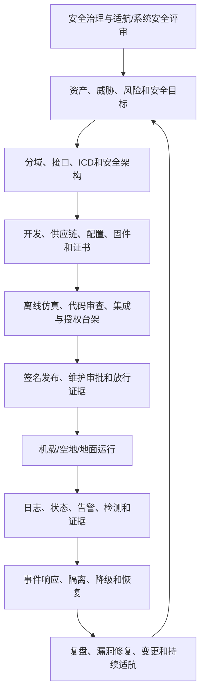

# 类型三-3：航空机载与空地通信全生命周期安全管控体系

**比赛：** 航空协议安全锦标赛初赛  
**题目类型：** 类型三第 3 题（选答）  
**版本：** 1.0  
**日期：** 2026-09-11  
**证据等级：** L1 本地复核 + L2 既有报告记载 + L3 工程设计；真实型号与台架项目为 L4 待实装验证  
**结论性质：** 研究与竞赛方案，不构成具体型号适航批准、运行放行或真实航空器安全结论

## 1. 摘要

本报告面向民用航空机载航电、客舱、维护、空地通信、地面保障和运行系统，设计覆盖“事前防护—事中检测—事后响应”的全生命周期网络安全管控体系。体系把资产和接口识别、架构分域、威胁建模、ICD/配置基线、供应链和补丁管理、身份与密钥生命周期、运行监测、事件响应、恢复复盘、持续适航和证据归档连接成闭环。

核心设计原则：机载航电、客舱、维护、空地和地面管理面必须分域；认证不等于授权，网络可达不等于业务可达，格式校验不等于来源真实性；任何跨域数据必须经过安全终止点、语义策略、新鲜度、速率和输出控制。真实设备只允许在授权、隔离、可审计和默认只读的前提下接入。

当前仓库提供 ARINC 429、RS-232/RS-422、5G-ATG、AFDX、ARINC 825/CAN、维护网络、USB、虚拟硬件、设备孪生和统一事件链的本地合成验证。该证据证明控制逻辑和状态机行为，不证明真实飞机、具体 LRU、真实无线链路或适航系统已经符合要求。

## 2. 场景、范围和安全目标

### 2.1 生命周期对象

| 对象 | 典型资产 | 主要保护属性 |
|---|---|---|
| 机载核心航电 | AFDX、ARINC 429/825、航电计算单元、传感器消费者 | 完整性、真实性、确定性、可用性、故障隔离 |
| 客舱域 | 客舱网络、Wi-Fi、USB、客舱应用 | 分域、可用性、隐私、不可到达航电写路径 |
| 维护域 | GSE、USB、RS-232、以太网加载、串口服务器 | 设备身份、配置完整性、审批、可追溯性 |
| 空地通信域 | 5G-ATG、ACARS、卫星、ADS-B、GPS 接收链 | 会话、来源、新鲜度、链路降级、业务隔离 |
| 地面保障/运营域 | OAM/OSS、跳板、N6 应用、运行监视、放行数据 | 管理面授权、飞机/航班绑定、审计和恢复 |
| 供应链/开发域 | 代码、固件、配置、证书、模型和报告 | 来源、签名、版本、依赖、可复现性 |

### 2.2 安全目标

1. 每个设备、端口、协议、配置和数据流有责任人、版本和生命周期状态；
2. 安全关键输入只来自经过认证、授权、语义和时效检查的路径；
3. 客舱、维护、空地和地面管理面不能绕过边界进入航电写入路径；
4. 配置、固件、密钥、证书、ICD 和策略都有批准基线、变更审批、回滚和失效机制；
5. 运行中异常可检测、可定位、可遏制、可恢复，且不破坏实时性和确定性；
6. 事件、决策、状态、证据和恢复动作可以按统一时间和因果关系重建；
7. 任何仿真或工程推演结论都不冒充真实飞机实测或适航结论。

## 3. 总体管控架构



### 3.1 安全域和边界

```text
[外部/企业域]
       ↓ B0 身份、终端、VPN
[地面保障/运营域]
       ↓ B1 跳板、工单、会话
[供应商维护/OAM域]
       ↓ B2 mTLS、RBAC、双人审批、签名配置
[5GC/N6/空地业务域]
       ↓ B3 飞机/航班/会话/消息授权
[客舱/维护域]
       ↓ B4 只读/单向/字段白名单
[跨域安全终止点]
       ↓ B5 物理发送使能、协议语义、速率和冗余
[机载航电核心域]
```

每个边界必须记录：输入来源、身份、设备、接口、协议、目标域、策略版本、时间、序列、决策、输出摘要和副作用。网络可达、账号登录成功、5G 注册成功、CRC/奇偶通过或管理请求到达，都不能直接代表下一域已获授权。

## 4. 事前防护：设计、建设和发布阶段

### 4.1 治理和责任

| 控制对象 | 必须建立的记录 | 责任和审批 |
|---|---|---|
| 资产 | 设备 ID、型号/版本、域、接口、数据等级、负责人、生命周期 | 系统工程+安全负责人 |
| ICD/协议 | 版本、字段、范围、周期、来源、消费者和安全目标 | 接口控制委员会 |
| 配置 | AFDX VL/BAG、A429 标签、CAN ID、VLAN、DNN/QFI/TEID、端口和策略 | 配置控制委员会+双人审批 |
| 软件/固件 | 来源、依赖、SBOM、签名、测试、回滚和支持期限 | 软件/供应链负责人 |
| 证书/密钥 | 所属设备、用途、有效期、轮换、吊销、备份和销毁 | 密钥管理负责人 |
| 风险 | 威胁、前提、影响、等级、检测、残余风险和接受人 | 系统安全+适航团队 |

禁止使用“系统内部可信”“专用网络天然安全”“维护人员默认可信”等未验证假设替代边界和授权记录。

### 4.2 安全架构和威胁建模

在设计冻结前完成：

1. 资产—接口—数据流—信任边界图；
2. 物理接入、无线空口、地面网络和供应链威胁场景；
3. 每个漏洞的触发条件、利用前提、适配设备、路径、业务影响、危害等级和阻断点；
4. 客舱/维护/空地到航电的最小数据集和方向；
5. 单点故障、共因故障、旁路、配置漂移、时钟失步和冗余失配分析；
6. 安全控制对延迟、带宽、BAG、CAN 仲裁、链路恢复和维护效率的影响；
7. 安全目标与 FHA/SSA、系统安全和适航活动的映射。

### 4.3 分域和接口设计

- 航电核心域与客舱、维护、空地、地面管理面物理/逻辑分离；
- 航电跨域默认拒绝，优先使用只读、单向或字段级代理；
- ARINC 429/825、串行和 AFDX 原生输入前设置受控入口；
- N6、OAM、SNMP、FTP/615A 和 USB 不能通过共享 VLAN、源 IP 或“已认证会话”直接获得航电写权；
- 物理端口、串口方向、A429 发送端、CAN 节点和 USB 数据能力默认关闭或白名单；
- 维护和运行数据分开排队、分开授权、分开审计，避免维护流影响实时安全流。

### 4.4 供应链和开发控制

| 阶段 | 控制 |
|---|---|
| 需求 | 安全需求、来源、可验证性和失效安全条件纳入基线 |
| 设计 | 代码审查、架构审查、接口/配置威胁建模和最小权限 |
| 构建 | 固定依赖、SBOM、可复现构建、签名构件、密钥隔离 |
| 测试 | 单元、接口、异常、边界、回放、故障注入和性能预算 |
| 发布 | 签名校验、目标设备/版本绑定、双人审批、分阶段发布和回滚 |
| 维护 | 版本支持期、漏洞通告、补丁评估、配置差异和证据保留 |

不将未经批准的第三方固件、真实凭据、厂商保密 ICD 或真实飞机数据提交到公共仓库。

## 5. 身份、证书和密钥生命周期

### 5.1 设备和人员身份

设备身份必须与型号、序列号、固件、接口和安全域绑定；人员身份必须与角色、培训、工单、维护窗口和审批绑定。供应商账号、应急账号和自动化账号分离，禁止共享账号和长期未审计高权限。

### 5.2 生命周期状态

```text
planned → provisioned → active → suspended → rotated → revoked → retired → destroyed
```

每个状态转换记录操作人/系统、原因、时间、审批、旧版本、新版本和证据 ID。证书过期、吊销、设备更换、固件回滚、时钟异常和密钥不可用时必须进入定义的安全降级，不得静默绕过认证。

### 5.3 密钥控制

- 密钥只在受控后端或批准硬件中使用，浏览器不持有密钥；
- 密钥用途、算法、设备/会话绑定、轮换和吊销有明确记录；
- 认证覆盖通道、来源、目标、消息类型、序列、时间、飞机/航班/会话和语义摘要；
- 密钥轮换不破坏实时关键流和恢复能力，需验证旧/新密钥交接窗口；
- 仿真 HMAC 只能作为可复现实验接口，不能直接宣称为机载密码方案。

## 6. 事中检测：运行安全监测体系

### 6.1 统一遥测和事件字段

所有协议和设备事件至少包含：

```text
run_id / deployment_id
sim_time_ms / wall_time
sequence / parent_event_id
user_id / device_id / model_version
source_domain / target_domain
source_interface / target_interface
protocol / message_class
session_id / aircraft_id / flight_id
policy_id / policy_version
observed_value / expected_value
input_digest / output_digest
decision / reason / physical_output
confidence / evidence_level
```

### 6.2 分层检测

| 层级 | 检测内容 | 示例 |
|---|---|---|
| 物理/链路 | 端口、链路、速率、负载、错误、冗余 | A429速率失配、CAN错误计数、AFDX A/B不一致 |
| 协议 | 格式、版本、序号、会话、路由、仲裁 | CRC通过但认证失败、TEID/QFI错配、BAG超限 |
| 设备 | 电源、固件、配置、心跳、健康 | USB固件未签名、PX4传感器超时、状态 stale |
| 业务 | 范围、变化率、飞机/航班/任务、幂等 | 错飞机数据、陈旧维护包、异常航电值 |
| 边界 | 方向、域、角色、策略和输出 | 客舱到航电写入尝试、OAM关闭边界 |
| 运营 | 身份、工单、窗口、行为基线 | 非窗口维护、供应商异常会话、异常配置 diff |

### 6.3 状态真实性

浏览器和 SOC 必须分别显示：

```text
电源状态
物理链路状态
协议会话状态
认证状态
授权状态
数据流状态
健康/降级状态
配置漂移状态
证据来源、时间、年龄、可信度和等级
```

采集失败后由 `fresh` 转为 `stale`、`degraded`、`offline` 或 `unknown`，不能继续显示正常在线。观察值和期望值不一致时显示 `drifted` 并列出字段差异。

### 6.4 告警和检测质量

告警规则必须说明：触发条件、数据源、窗口、阈值、误报/漏报边界、责任人、响应期限和证据保留期。没有真实传感器统计时，检测概率只能标为工程估计，不能写成实测精确成功率。

建议优先级：

- **P1：** 航电写路径、物理旁路、关闭边界、未授权配置生效；立即隔离和人工升级；
- **P2：** OAM/DNN/路由变更、持续重放/洪泛、异常原生输出；撤销会话并回滚；
- **P3：** 单条认证失败、过期、语义越界、未知设备；丢弃、计数、告警；
- **P4：** 配置漂移、低风险管理异常、状态过期；纳入维护工单和复核。

## 7. 事后响应、恢复和复盘

### 7.1 响应流程

```text
发现
 → 分级
 → 保全证据
 → 限制传播
 → 隔离来源/会话/端口
 → 保护关键业务
 → 分析根因
 → 恢复可信基线
 → 分阶段复通
 → 复盘与持续适航更新
```

### 7.2 遏制动作

按影响选择最小范围动作：

- 丢弃单条消息，不影响合法流；
- 隔离来源、账号、设备、端口、节点或会话；
- 关闭串口/USB/A429/CAN 发送使能；
- 冻结 OAM、SNMP、N4/PFCP、VLAN、DNN/S-NSSAI、VL/BAG 和策略变更；
- 切换只读、备用或安全降级；
- 保留时间线、配置 diff、输入/输出摘要和物理输出状态。

不要通过清除日志、盲目重启、关闭检测或恢复全部路由来“快速恢复”。

### 7.3 恢复前置检查

1. 身份、设备和证书重新认证；
2. 工单、维护窗口和双人审批重新确认；
3. 固件、配置、ICD、策略、证书和路由与签名基线一致；
4. 清除旧消息、旧队列、旧序列、旧会话和旧权限；
5. 检查时间同步、冗余、负载、链路和消费者状态；
6. 确认异常数据没有写入业务数据库、维护放行数据或安全消费者；
7. 证据链完整且恢复动作可追溯。

### 7.4 分阶段恢复

```text
隔离态：全部可疑写路径阻断，保留只读诊断
基线态：恢复最后可信签名配置/固件/策略
观测态：只放行合成或只读流，观察告警和副作用
受控业务态：按域、会话、消息类型和风险逐步恢复
复盘态：归档事件、根因、漏洞、变更和待补证据
```

恢复动作必须有成功标准和回滚动作；不能把“设备重新上线”当作恢复完成。

## 8. 漏洞、补丁和配置生命周期

### 8.1 漏洞管理

- 接收内部发现、供应商通告、CVE、标准更新和运行告警；
- 关联资产、型号、版本、接口、漏洞编号和业务功能；
- 按极高/高/中/低和暴露前提排序；
- 评估补丁对实时性、确定性、冗余、证书、启动和维护的影响；
- 在离线仿真和授权台架完成正常、负向、回放、恢复和性能验证；
- 分阶段发布，保留已批准回滚版本；
- 更新风险接受、配置基线、报告和持续适航记录。

### 8.2 配置漂移

重点监测：

```text
AFDX VL/BAG/冗余
ARINC 429 标签/速率/发送端
ARINC 825 节点/ID/负载策略
VLAN/路由/ACL/SSID
DNN/S-NSSAI/QFI/TEID/N3/N6
OAM/SNMP角色和管理面
USB批准设备/固件/设备类
串口方向/波特率/维护互锁
```

任何漂移先进入 `drifted/pending_review`，不得自动当作合法新配置。配置发布必须能从旧版本恢复，并验证没有隐藏旁路或旧权限残留。

## 9. 合规和安全工程映射

| 管控活动 | 需要映射的依据 | 项目证据 |
|---|---|---|
| 航空器网络安全过程 | DO-326A/ED-202A | 网络安全计划、资产/威胁/风险和验证记录 |
| 航空器网络安全方法 | DO-356A/ED-203A | 架构、威胁分析、保护措施和安全论证 |
| 持续适航安全 | DO-355/ED-204A | 漏洞、补丁、变更、事件和复盘记录 |
| 系统开发与安全目标 | ARP4754A、ARP4761A | 安全需求、FHA/SSA、失效和独立性分析 |
| 运输类飞机系统安全 | CCAR-25 §25.1309 | 具体型号安全分析和适航提交材料 |
| 协议/接口 | ARINC 429/664/825/615A、3GPP TS 系列 | 版本、章节、ICD、配置和测试映射 |
| 组织运行 | 民航网络安全相关规章和运行程序 | 账号、维护、供应商、应急和审计流程 |

标准和规章版本、章节、适用性以及符合性结论必须由团队适航/合规负责人冻结；本表不是自动合规声明。

## 10. 证据、仿真和验收体系

### 10.1 证据等级

- **L1 本地复核：** 测试直接验证模型行为；
- **L2 既有报告记载：** 已有实验输出和报告引用；
- **L3 工程推演：** 有架构和标准依据但无目标设备实测；
- **L4 待实装验证：** 需要真实 ICD、设备、日志或授权台架。

### 10.2 最低验收门槛

| 类别 | 验收要求 |
|---|---|
| 资产 | 设备、端口、协议、域、负责人和版本完整 |
| 架构 | 数据流、信任边界、旁路和失效模式有图和说明 |
| 防护 | 默认拒绝、身份/授权、语义、新鲜度、速率和配置控制可验证 |
| 检测 | 事件包含统一时间、序号、来源、策略、状态和证据 |
| 响应 | 可隔离、保全证据、保护关键业务和逐步恢复 |
| 回放 | 同 commit、场景、输入摘要和 seed 生成稳定结果 |
| 实时性 | 认证/检查/隔离不破坏明确的周期、BAG、仲裁和恢复预算 |
| 合规 | 每个标准/规章/技术结论有来源和适用性记录 |
| 边界 | 不连接真实飞机、生产网络、公共频谱或未授权设备 |

### 10.3 当前仓库复现

```bash
python3 -m pytest -q
python3 scripts/run_all_simulations.py --profile quick
python3 scripts/run_cross_model_chain.py --scenario normal
python3 scripts/run_cross_model_chain.py --scenario injection
```

当前本地模型覆盖 ARINC 429、RS-232/422、5G-ATG、AFDX、ARINC 825/CAN、维护网络、USB、虚拟硬件和设备孪生；一键运行清单为 `artifacts/one-click/manifest.json`。所有结果均为 simulation-only。

## 11. 运行组织和持续改进

### 11.1 角色

- **系统安全负责人：** 安全目标、风险等级、残余风险和安全论证；
- **协议/接口负责人：** ICD、模型、策略、性能和负向验证；
- **平台/DevSecOps 负责人：** CI、依赖、签名构建、证据包和访问控制；
- **运行/SOC负责人：** 告警、事件、隔离、恢复和复盘；
- **适航/合规负责人：** 标准、规章、章节和提交材料；
- **题目报告负责人：** 赛题映射、引用、证据等级和最终报告。

每个题目必须有主责人和至少一名非作者审查人；安全结论、跨域链路和最终报告至少两名审查人。

### 11.2 度量指标

只使用可追溯的工程指标：

```text
资产清单完整率
签名配置覆盖率
过期证书/固件数量
高风险漏洞关闭时长
未授权跨域尝试检测率
状态 stale 到告警时延
事件证据完整率
恢复演练成功率
误拒绝和关键流超时数量
```

指标必须注明采集范围、时间窗口、数据源和局限，不用单一“安全分数”替代航空业务风险。

## 12. 局限与待补证据

当前未提供：

1. 具体机型真实网络、ICD、设备版本和配置；
2. 真实 5GC/gNB/UE、OAM、N6、串口服务器、交换机、LRU 和飞控设备；
3. 真实电气波形、RF传播、EMI/ESD、冗余和物理互锁数据；
4. 真实账号、密钥、证书、供应商和维护流程；
5. 真实运行日志、告警基线、放行数据和持续适航记录；
6. 标准/规章的项目冻结版本和具体符合性审查结果。

这些内容必须在合法授权、隔离台架、数据处理许可和安全评审下补齐。缺失时保留为工程推演或待实装验证，不升级为真实漏洞或适航结论。

## 13. 结论

全生命周期安全不是上线前增加一个防火墙，而是从资产和 ICD 开始，将架构分域、身份与密钥、供应链、配置和固件、仿真验证、运行检测、事件响应、恢复和持续适航连接成可审计闭环。

对本项目最关键的管控要求是：

```text
事前：明确资产、边界、权限、配置基线和安全目标
事中：检测来源、会话、新鲜度、语义、负载、漂移和跨域输出
事后：隔离、保全证据、恢复签名基线、验证无副作用、复盘更新
```

本方案与现有仿真平台的安全边界一致：浏览器不连接真实设备；仿真不发射 RF、不操作真实串口/总线、不连接飞机或生产网络；模型证据不能写成真实航空系统已被攻破。

## 14. 参考文献与证据索引

- `[S1]` RTCA DO-326A/ED-202A；网络安全过程，项目交付前冻结版本和章节。
- `[S2]` RTCA DO-356A/ED-203A；航空器网络安全方法，项目交付前冻结版本和章节。
- `[S3]` RTCA DO-355/ED-204A；持续适航安全活动，项目交付前冻结版本和章节。
- `[S4]` ARP4754A、ARP4761A；系统开发和安全评估，适用性由适航团队确认。
- `[S5]` CCAR-25 §25.1309；具体适用性和提交要求由合规团队确认。
- `[S6]` ARINC 429、ARINC 664/AFDX、ARINC 825、ARINC 615A；具体规范版本和 ICD 待冻结。
- `[S7]` 3GPP TS 23.501、23.502、24.501、29.244、29.281、33.501；目标 5GS 版本待冻结。
- `[E1]` `report/type3_q1_high_risk_mitigation.md`：逐漏洞缓解措施。
- `[E2]` `report/type3_q2_defense_in_depth.md`：地面网络跨域链路纵深防御。
- `[E3]` `report/chain3_ground_network_attack_chain.md`：攻击链节点、边界、量化和阻断点。
- `[E4]` `sim/twin/chain.py`、`sim/twin/message.py`：统一事件、语义消息、策略和证据摘要。
- `[E5]` `scripts/run_all_simulations.py`：一键仿真和运行清单。
- `[E6]` `sim/*.py`、`tests/*.py`、`artifacts/*.json`：本地模型和行为证据。

## 15. 独立完成与工具使用声明

本报告依据比赛题目、`needed.txt`、`Aerospace-needed.txt`、团队仓库模型、测试、报告和实验结果整理。当前实现和证据为合成、确定性、simulation-only 内容；标准版本、具体机型资料、真实设备状态、台架结果和适航符合性必须由团队成员人工复核、合法取得并单独批准。